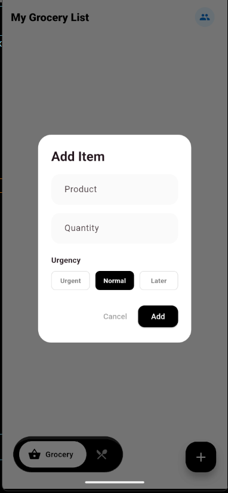
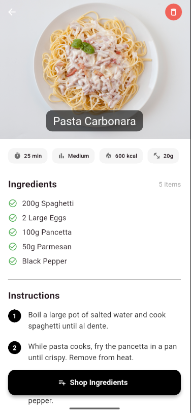

# FoodSync 🍎

**FoodSync** is a smart mobile application built with **Flutter** and **Riverpod** that bridges the gap between meal planning and grocery shopping. It solves the common disconnect between discovering recipes and actually buying the ingredients.

> **Repo:** [https://github.com/krishj7725/foodsync](https://github.com/krishj7725/foodsync)


## ✨ Key Features

### 🛒 Smart Grocery List
* **Priority Sorting:** Items are automatically sorted by urgency (Urgent 🔴, Normal, Later 🔵) and status.
* **Smart Merge:** The app detects duplicate items and merges quantities automatically (e.g., adding "Milk" twice results in one entry with combined details).
* **Persistence:** Data is saved locally using `SharedPreferences`, so your list never vanishes on restart.
* **UX Polish:** Swipe-to-delete with **Undo** functionality.

### 📖 Digital Cookbook
* **Recipe Management:** Create custom recipes with cooking time, difficulty, and nutritional stats.
* **Smart Input:** Auto-formats text fields (e.g., typing "350" automatically saves as "350 kcal").
* **Hybrid Image Support:** Add photos via **Internet URL** or pick directly from your **Phone Gallery**.
* **Seamless Integration:** Transfer ingredients from any recipe directly to your grocery list with a single tap.

### 🔮 Roadmap (Coming in v2.0)
* **Family Sync:** Real-time list sharing between multiple devices (Firebase Integration).
* **Smart Chef AI:** A recommendation engine that suggests recipes based on what is currently in your fridge.

## 📸 Screenshots

| Grocery List | Recipe Detail | Add Recipe |
|:---:|:---:|:---:|
|  |  |  |

## 🛠️ Tech Stack & Architecture

* **Framework:** Flutter (Dart)
* **State Management:** Riverpod 2.0 (ConsumerWidgets, StateNotifiers)
* **Testing:** Unit Tests for business logic (Providers & Models) using `flutter_test`.
* **Local Storage:** Shared Preferences (JSON Serialization)
* **Plugins:** `image_picker`, `google_nav_bar`, `shared_preferences`
* **Architecture:** Feature-first folder structure for scalability.

## 🚀 Getting Started

Follow these steps to run the project locally.

### Prerequisites
* Flutter SDK installed ([Guide](https://flutter.dev/docs/get-started/install))
* VS Code or Android Studio

### Installation

1.  **Clone the repository:**
    ```bash
    git clone [https://github.com/krishj7725/foodsync.git](https://github.com/krishj7725/foodsync.git)
    ```

2.  **Navigate to the project directory:**
    ```bash
    cd foodsync
    ```

3.  **Install dependencies:**
    ```bash
    flutter pub get
    ```

4.  **Run the app:**
    ```bash
    flutter run
    ```

## 🤝 Contributing

Contributions are what make the open-source community such an amazing place to learn, inspire, and create. Any contributions you make are **greatly appreciated**.

1.  Fork the Project
2.  Create your Feature Branch (`git checkout -b feature/AmazingFeature`)
3.  Commit your Changes (`git commit -m 'Add some AmazingFeature'`)
4.  Push to the Branch (`git push origin feature/AmazingFeature`)
5.  Open a Pull Request

## 📄 License

Distributed under the MIT License. See `LICENSE` for more information.

---

## 📬 Contact

**Krish Jain** - **LinkedIn:** [linkedin.com/in/krishj7725](https://www.linkedin.com/in/krishj7725/)  
- **Email:** [krishjain7725@gmail.com](mailto:krishjain7725@gmail.com)  
- **GitHub:** [@krishj7725](https://github.com/krishj7725)

Project Link: [https://github.com/krishj7725/foodsync](https://github.com/krishj7725/foodsync)
